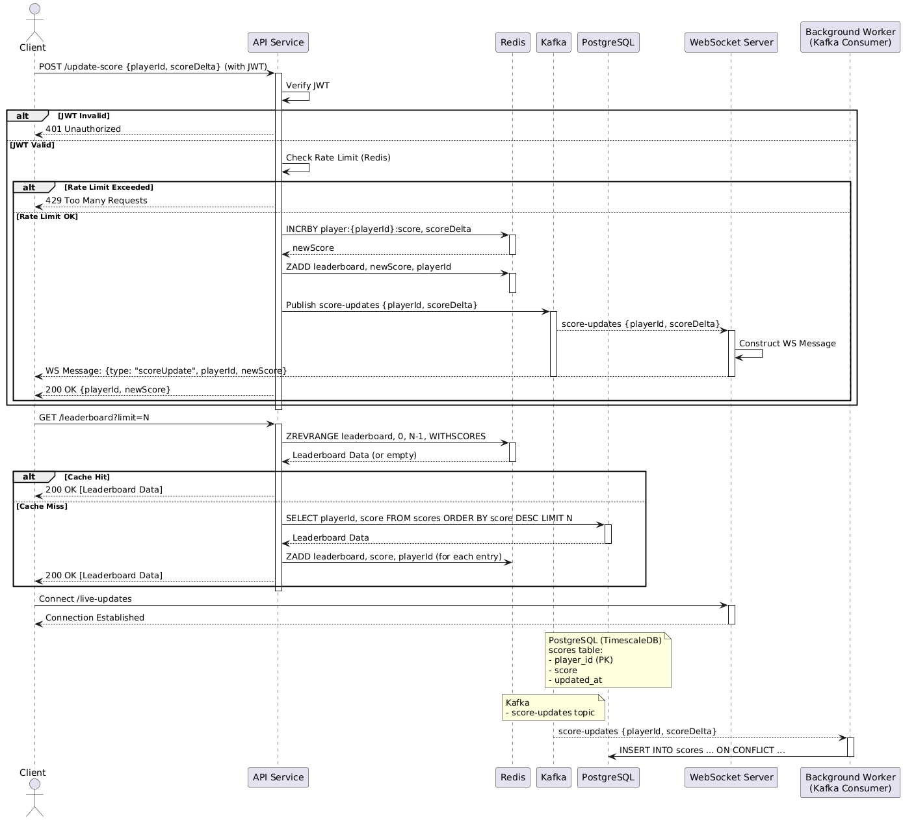

## Sequence Diagram for Score Update and Broadcast

This diagram illustrates the flow of execution when a client updates a user's score, retrieves the leaderboard, connects to the WebSocket server, and the subsequent real-time broadcast to connected clients. It also shows the interaction with Redis, Kafka, and PostgreSQL.

To generate the diagram image (`diagram.png`), you can use a [PlantUML](https://www.plantuml.com/plantuml/uml/SyfFKj2rKt3CoKnELR1Io4ZDoSa70000) renderer

Copy the contents of `diagram.puml` and paste it into an online PlantUML renderer.
